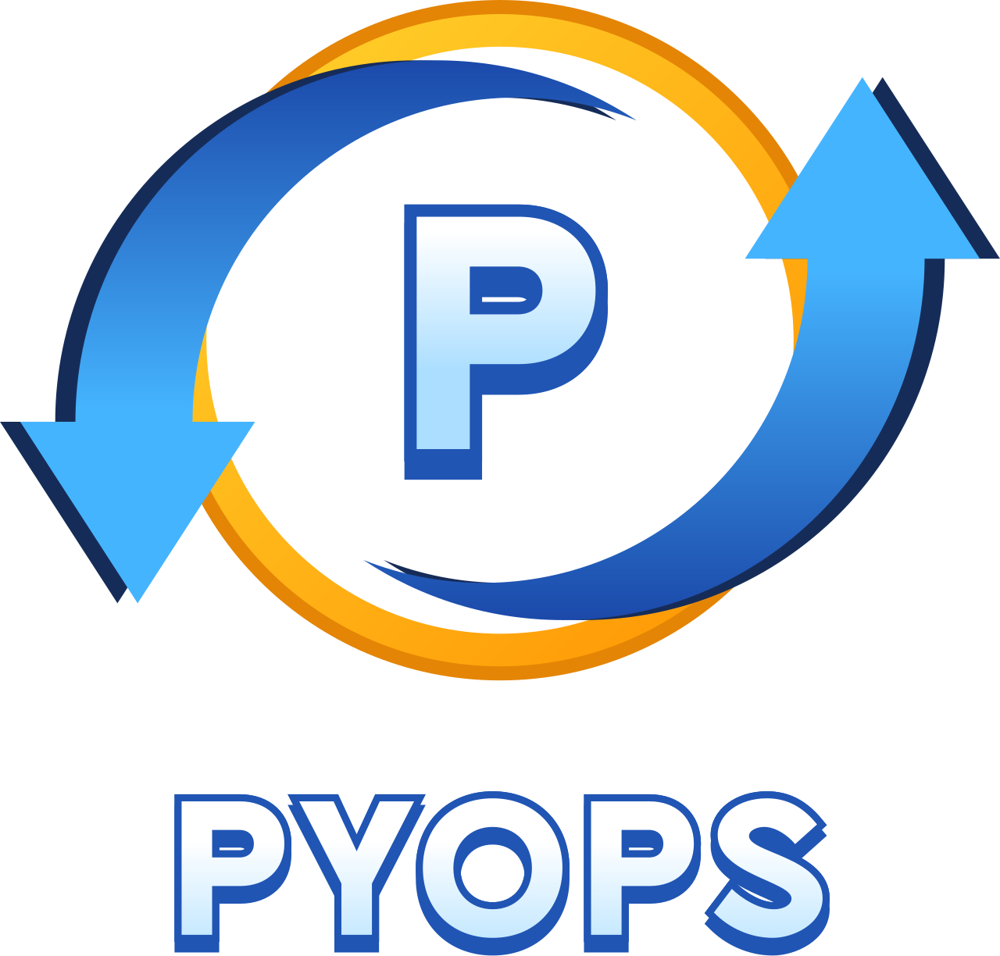

# pfo CLI Tool

This is the pfo CLI Tool.

## Prerequisites

To run the installation of these repos, you will need to install these prerequisites.

- Mac _(Apple)_
- Python 3.12^
- asdf
- gh

From the root of the repo:

```bash
brew bundle
```

This will install asdf, Python, etc. You may need to reshim the asdf install:

```bash
asdf reshim
```

More information on [asdf](https://asdf-vm.com/)

This codebase requires a Doppler account, and a GH token. Please review the following documentation on installing/attaining both.

- [Doppler](https://dashboard.doppler.com/register)
- [GH Token](https://docs.github.com/en/authentication/keeping-your-account-and-data-secure/managing-your-personal-access-tokens)

Note: The Doppler CLI, and the gh CLI are installed with the Brewfile _(run the brew bundle command above)_.

## Installing the CLI Repo Template

**STOP!**

Before running the commands, we want to ensure that the PATH is set:

Run `make setup` to set the environment variable. The command a command to run
at the command prompt. Export the environment variable and the continue with running
the following commands in the README. Once the environment variable is exported to
your SHELL, navigate to the directory where you would like to create your
project and run one of the subsequent following commands:
